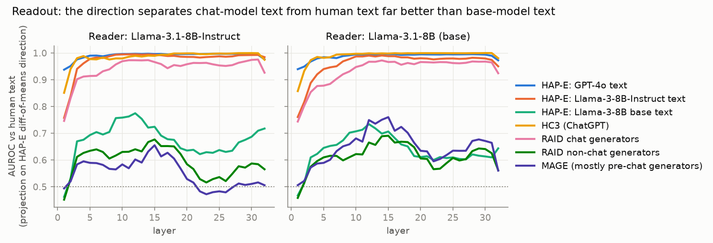
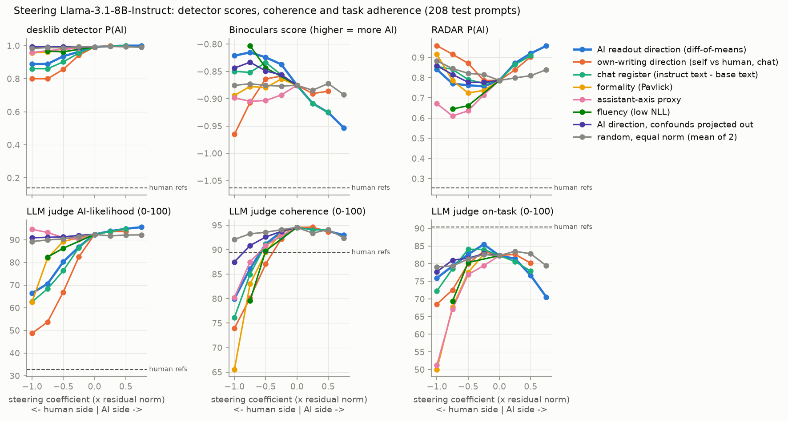
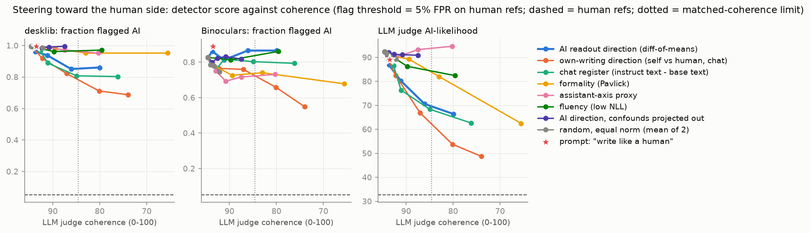
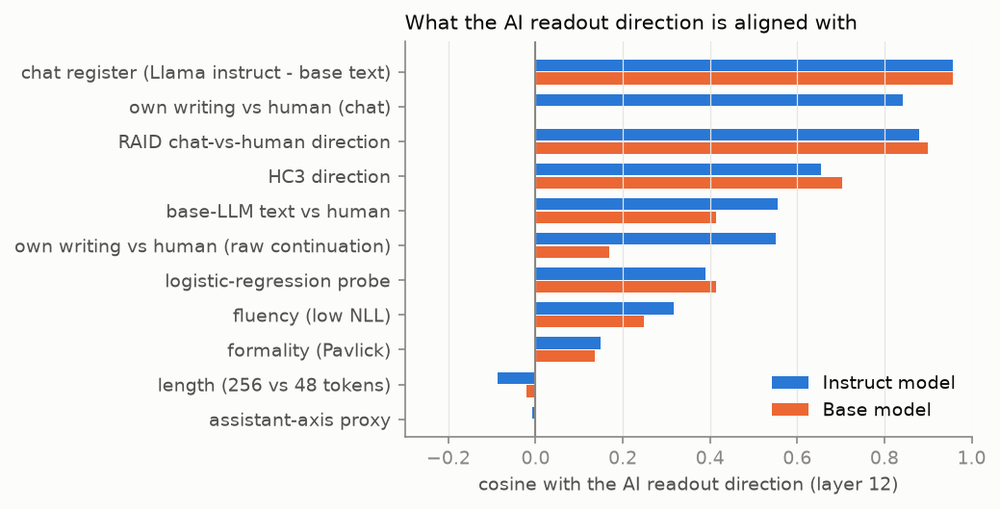
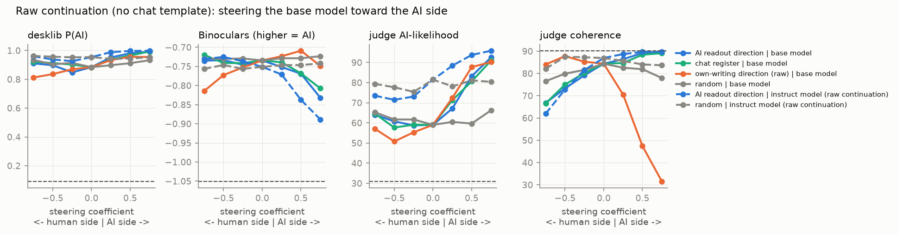

# Is there a "sounds like AI" direction in the residual stream?

Model studied: `meta-llama/Llama-3.1-8B-Instruct` and its base model `meta-llama/Llama-3.1-8B`.
All numbers below come from the files in `results/`; nothing is simulated.

## 1. Executive Summary

**Question.** The direction that separates human-written from AI-written text in LLM
activations can be read out. Is it causal for generation, and is it a distinct "AI-ness"
direction or a relabelling of formality, fluency, length, domain or the assistant persona?

**Answer.** There is a single, steerable direction, but "AI authorship" is the wrong name
for it. It is the **register of chat-tuned models**.

- **Causal, with a specific but partial effect.** Adding the direction's negative during
  generation (layer 12) makes Llama-3.1-8B-Instruct's output read as less AI-written to an
  LLM judge (mean AI-likelihood 92.4 → 70.6; share of texts above the judge's 5%-FPR threshold
  98.6% → 41%) at the largest coefficient that keeps judge coherence within 10 points of
  unsteered (94.6 → 86.1). Two equal-norm random directions, a formality direction, an
  assistant-axis proxy and a "write like a human" system prompt do not do this (random:
  ≤ 5 points; prompt: 3.3 points). Ablating the direction at every layer has a similar effect
  (74.0). Steering the other way raises all AI scores that have headroom.
- **Not detector-general.** The best supervised detector (desklib) moves in the same direction
  but only slightly (flagged 99.5% → 85%; human references 5%). RADAR does not move beyond the
  random control. A Binoculars-style zero-shot detector moves the *opposite* way (83% → 87%
  flagged when steering "toward human", 49% when steering "toward AI"). So the direction
  changes how the text reads; it does not make it statistically human-like, and it is not a
  practical evasion tool at preserved coherence.
- **Not distinct from chat register; distinct from the other candidates.** Cosine with the
  direction "Llama-instruct text minus Llama-base text" is 0.96 (0.88 when the two directions
  are built from disjoint generators). Steering with that direction reproduces the effect, and
  removing its span from the AI direction abolishes the effect. Cosine with formality is 0.15,
  fluency 0.32, length −0.09, assistant-axis proxy −0.01; none of these reproduces the effect
  at matched coherence.
- **It does not encode "written by a model".** Text written by *base* LLMs lies only about one
  human standard deviation toward the "AI" side (AUROC 0.75–0.78), against 4.4–4.8 SD for
  chat-model text (AUROC ≥ 0.99). RAID non-chat generators: 0.64; MAGE: 0.60.
- **Base vs instruct.** The direction already exists in the base model (cosine 0.84 with the
  instruct model's direction, same readout quality). Chat tuning does not sharpen the
  representation; it moves the model's own writing along it: own-writing offset 0.45 SD
  (base, raw continuation) → 1.39 SD (instruct, raw continuation) → 3.9 SD (instruct, chat
  template). Adding the direction to the base model makes its continuations read as AI to the
  judge (59 → 92.5) while judged coherence goes up, not down.

**Practical implication.** Activation-probe detectors of the kind in the literature are, in
this model, detectors of chat-model register. That explains both their strong transfer across
chat generators and their weakness on base-model text, and it means the same vector is a
style control rather than an authorship variable.

## 2. Research Question & Motivation

Linear probes on LLM activations detect machine-generated text better than dedicated
detectors (Quaremba et al. 2608.24780; SV-Detect 2606.07313; Kuznetsov et al. 2503.03601).
All of that work is readout: an LLM reads someone else's text. None of it intervenes on the
direction while the model writes and scores the result with a detector that did not see the
activations, and none controls for formality, fluency, length, domain or the assistant persona
(Lu et al. 2601.10387). Xu et al. (2605.19516) show that base-model continuations look human
to commercial detectors, which suggests that what detectors see is post-training register.

Sub-hypotheses (pre-specified in `planning.md`):

- **H1 readout** — a diff-of-means direction from matched pairs separates held-out human and
  AI text across genres, generators and datasets.
- **H2 causal** — steering toward the human side lowers independent-detector AI scores more
  than equal-norm random and confound directions at matched coherence; the reverse raises them.
- **H3 distinct** — the direction is not formality / fluency / length / genre / chat register /
  assistant axis.
- **H4 base vs instruct** — the direction exists in the base model and chat tuning moves the
  model's own writing along it.

## 3. Experimental Setup

### Models and hardware
- Steered and read: Llama-3.1-8B-Instruct and Llama-3.1-8B (base), bf16, one NVIDIA RTX A6000
  (48 GB). Generation batch 50–104, activation extraction batch 32–48.
- Python 3.12.8, torch 2.6.0+cu124, transformers (see `requirements.txt`). Seed 42 for data
  splits; generation seeds fixed per batch (`src/common.py`).
- Wall time: activation extraction ≈ 20 min per model; main steering run ≈ 2 h 10 min
  (64 conditions × 208 prompts, shared GPU); scoring ≈ 50 min.

### Data (`src/prep_data.py` → `results/data/`)
| Use | Source | Size |
|---|---|---|
| Fit the AI direction | HAP-E (human continuation vs LLM continuation of the same 500-word prefix) | 200 docs × 6 genres; human + 4 chat generators (GPT-4o, GPT-4o-mini, Llama-3-8B/70B-Instruct) + 2 base generators (Llama-3-8B/70B) |
| Held-out readout | HAP-E | 100 docs × 6 genres, same sources |
| Transfer | HC3 (676 pairs), RAID no-attack (480 human + 5,233 generated, 11 generators, 8 domains), MAGE test (800 + 800) | — |
| Formality direction | Pavlick & Tetreault sentences, top vs bottom quintile | 900 + 900 train |
| Generation prompts (test) | 84 HAP-E continuation prompts, 69 HC3 questions, 55 RAID writing prompts; each with a matched human reference | 208 |
| Generation prompts (dev / fit) | same three sources, disjoint documents | 89 / 455 |
| Raw-continuation prompts | HAP-E prefixes, no chat template | 180 fit / 150 test |

All texts are read as `BOS + text`, truncated to 256 tokens, so text length is equalised.
Activations are mean-pooled over text tokens at the output of every block.

### Directions (`src/directions.py`, `src/fit_acts.py`)
All are unit vectors at layer 12 (hidden-state index 12 of 32).

| Name | Definition |
|---|---|
| `ai_read` (primary) | mean(chat-generator texts) − mean(human continuations), HAP-E train |
| `ai_lr` | logistic-regression probe weights on the same data |
| `write_chat` | the instruct model's own response activations − the matched human reference teacher-forced in the same assistant slot (455 fit prompts) |
| `write_raw` | own raw continuation − true human continuation after the same prefix |
| `chat_register` | Llama-3-8B/70B-Instruct texts − Llama-3-8B/70B base texts (HAP-E) |
| `ai_base_gens` | base-LLM texts − human texts |
| `ai_hc3`, `ai_raid` | the same contrast fitted on HC3 / RAID chat generators |
| `formality` | formal − informal Pavlick sentences |
| `fluency` | low-NLL − high-NLL terciles of human texts (NLL under the reading model) |
| `length` | 256-token pooling − 48-token pooling of the same human texts |
| `assistant_axis` | default-assistant responses − mean of 40 role-play personas (roles and questions from the Assistant Axis repository; 8 questions per role; no judge filtering) |
| `random0/1` | fixed Gaussian directions |
| `ai_read_perp_all` | `ai_read` with the span of formality, fluency, length, chat register, assistant axis and the 5-D genre subspace projected out |
| `ai_read_perp_persona` | `ai_read` with chat register and assistant axis projected out |

### Interventions (`src/steer.py`)
- **Addition**: `h ← h + c · ‖h‖̄ · û` at layer 12, every position, where `‖h‖̄ = 4.0` is the mean
  residual norm at that layer. The human→AI mean gap is 1.30, so `c = 0.33` is one natural gap.
  Every direction is applied at the same absolute norm for a given `c`.
- **Ablation**: project `û` out of the output of every block.
- **Prompt baselines** (system prompt): "Write like a human, not like an AI. Your text must
  read as if a real person wrote it: natural and unpolished where appropriate, with none of the
  phrasing, structure or tone typical of AI assistants." and an "unmistakable AI assistant
  style" counterpart.
- Decoding: sampling, temperature 0.7, top-p 0.95, 200 new tokens, same seeds across conditions.
- Layer 12 and the coefficient grid {0.25, 0.5, 0.75, 1.0} were chosen on the 89 dev prompts
  (`results/gens/pilot_dev.jsonl`; layers 8/12/16/20 compared using desklib, external NLL and
  distinct-3). Test prompts were not used for any choice.

### Measures (`src/score.py`, `src/judge.py`)
None of them uses Llama activations.

| Measure | What it is | Validation on test prompts: unsteered output vs matched human references |
|---|---|---|
| LLM judge AI-likelihood (0–100) | `openai/gpt-5.6-terra` via OpenRouter, temperature 0, blind to condition, also rates coherence and on-task | AUROC 0.991, TPR@5%FPR 0.986 |
| desklib | `desklib/ai-text-detector-v1.01`, supervised DeBERTa-v3-large | AUROC 0.998, TPR 0.995 |
| Binoculars-style | log-PPL / cross-PPL with `Qwen/Qwen2.5-7B` (observer) and `Qwen2.5-7B-Instruct` (performer), sign flipped so higher = AI | AUROC 0.933, TPR 0.827 |
| HC3 RoBERTa | `Hello-SimpleAI/chatgpt-detector-roberta` | AUROC 0.939, TPR 0.740 |
| RADAR | `TrustSafeAI/RADAR-Vicuna-7B` | AUROC 0.858, TPR 0.216 |

Pre-specified rule: detectors with validation AUROC > 0.8 count. All five pass, but RADAR is
weak (TPR 0.22) and the HC3 RoBERTa result turned out to be a length artifact (§4.2), so the
conclusions rest on the judge, desklib and Binoculars.

Other measures: judge coherence and on-task (0–100); mean token NLL under Qwen2.5-7B;
distinct-3; formality (`s-nlp/roberta-base-formality-ranker`); cosine of `all-mpnet-base-v2`
embeddings with the unsteered output for the same prompt; and "readback" — the generated text
re-read by the unsteered model and projected on `ai_read`, in human-text SD units (not an
independent detector; a closed-loop check).

"Flagged" means above the threshold that gives 5% false positives on the human references of
the same prompts.

### Statistics
Paired over prompts. 95% bootstrap CIs (2,000 resamples) on per-prompt differences. Wilcoxon
signed-rank tests of each steered condition against the mean of the equal-norm random
controls at the same signed coefficient, Holm-corrected within each metric across all
conditions (`results/vs_random_*.csv`). Matched coherence: for each direction, the largest
|c| whose mean judge coherence **and** on-task score are both within 10 points of unsteered.

### Cost
Judge calls: ≈ 20,100 unique, ≈ 11.2 M input and 1.2 M output tokens. At the listed
$2 / $12 per million tokens that is roughly $37. The OpenRouter key hit its $150 daily limit
near the end of the session (the key's own counter showed $150.13 for the day; the gap to my
token-based estimate is not explained by anything I can see). The only analysis affected is
the judge half of the truncation control (§4.2).

## 4. Results

### 4.1 Readout (H1): strong for chat-model text, weak for base-model text

Layer 12, AUROC of the projection on `ai_read` against human text (`results/readout_*.json`):

| Test set | Instruct reader | Base reader |
|---|---|---|
| HAP-E held-out, chat generators (diff-of-means / LR probe) | 0.996 / 1.000 | 0.991 / 0.999 |
| HAP-E GPT-4o text | 0.997 | 0.995 |
| HAP-E Llama-3-8B-Instruct text | 0.995 | 0.990 |
| **HAP-E Llama-3-8B base text** | **0.775** | **0.734** |
| **HAP-E Llama-3-70B base text** | **0.750** | **0.702** |
| HC3 (ChatGPT vs Reddit / forum answers) | 0.990 | 0.999 |
| RAID chat generators | 0.973 | 0.967 |
| **RAID non-chat generators** | **0.640** | **0.665** |
| MAGE (mostly pre-chat generators) | 0.602 | 0.749 |
| Leave-one-genre-out, HAP-E (min–max over 6 genres) | 0.981–1.000 | 0.969–1.000 |

- The direction generalises across genre, across chat generators, and across datasets:
  directions fitted on HC3 and RAID reach 0.971 and 0.993 on HAP-E.
- In human-SD units along the direction, chat-model texts sit at 4.4–4.8 and base-model texts
  at 1.0–1.1 (instruct reader).
- A direction fitted on GPT-4o text only separates Llama-instruct text at 0.990 and
  Llama-base text at 0.674 (`results/geometry.json`), so this is not an artifact of which
  generators were in the fit.
- The LR probe reads out slightly better and has cosine 0.39 with the diff-of-means direction.

### 4.2 Causal test (H2)

Main run, 208 test prompts, layer 12 (`results/table_main_test.csv`). Flags use the 5%-FPR
thresholds. "sim" is the embedding cosine with the unsteered output (0.78 between two
unsteered samples with different seeds).

| condition | coef | judge AI | judge flag | desklib | desklib flag | Binoculars flag | RADAR | coherence | on-task | ext. NLL | distinct-3 | sim | readback |
|---|---|---|---|---|---|---|---|---|---|---|---|---|---|
| human references | | 32.8 | 0.03 | 0.139 | 0.05 | 0.05 | 0.25 | 89.4 | 90.3 | 2.68 | 0.99 | | 0.54 |
| unsteered | | 92.4 | 0.99 | 0.992 | 1.00 | 0.83 | 0.79 | 94.6 | 82.3 | 1.48 | 0.98 | 1.00 | 4.35 |
| unsteered, other seed | | 91.6 | 0.97 | 0.984 | 0.99 | 0.80 | 0.82 | 94.7 | 81.9 | 1.53 | 0.98 | 0.78 | 4.40 |
| prompt "write like a human" | | 89.1 | 0.90 | 0.993 | 1.00 | 0.89 | 0.74 | 93.5 | 80.7 | 1.56 | 0.98 | 0.75 | 4.04 |
| prompt "write like an AI" | | 94.2 | 1.00 | 0.997 | 1.00 | 0.75 | 0.84 | 94.4 | 80.6 | 1.47 | 0.98 | 0.80 | 5.05 |
| `ai_read` | −0.25 | 86.8 | 0.85 | 0.963 | 0.96 | 0.86 | 0.76 | 93.7 | 85.5 | 1.57 | 0.97 | 0.77 | 3.39 |
| `ai_read` | −0.50 | 80.3 | 0.63 | 0.936 | 0.94 | 0.81 | 0.76 | 91.2 | 82.6 | 1.67 | 0.93 | 0.72 | 2.54 |
| **`ai_read`** | **−0.75** | **70.6** | **0.41** | **0.889** | **0.85** | **0.87** | 0.77 | **86.1** | 79.3 | 1.79 | 0.89 | 0.65 | 1.55 |
| `ai_read` | −1.00 | 66.4 | 0.33 | 0.888 | 0.86 | 0.87 | 0.84 | 80.0 | 75.9 | 1.88 | 0.85 | 0.62 | 1.03 |
| `ai_read` | +0.25 | 93.8 | 0.99 | 0.997 | 1.00 | 0.69 | 0.87 | 94.3 | 81.4 | 1.47 | 0.99 | 0.80 | 5.29 |
| `ai_read` | +0.50 | 94.8 | 1.00 | 1.000 | 1.00 | 0.61 | 0.92 | 93.8 | 76.7 | 1.47 | 0.99 | 0.78 | 6.09 |
| `ai_read` | +0.75 | 95.6 | 1.00 | 1.000 | 1.00 | 0.49 | 0.96 | 93.0 | 70.6 | 1.53 | 0.99 | 0.75 | 6.83 |
| `ai_read` ablated, all layers | | 74.0 | 0.44 | 0.889 | 0.85 | 0.94 | 0.78 | 86.2 | 82.1 | 1.72 | 0.89 | 0.69 | 1.39 |
| `write_chat` | −0.25 | 82.5 | 0.69 | 0.942 | 0.92 | 0.76 | 0.79 | 92.2 | 83.5 | 1.78 | 0.97 | 0.74 | 3.14 |
| **`write_chat`** | **−0.50** | **66.9** | **0.35** | **0.857** | **0.82** | 0.76 | 0.87 | **87.1** | 79.9 | 2.16 | 0.94 | 0.65 | 1.70 |
| `write_chat` | −0.75 | 53.8 | 0.13 | 0.800 | 0.71 | 0.66 | 0.92 | 80.1 | 72.6 | 2.43 | 0.91 | 0.57 | 0.93 |
| `write_chat` ablated | | 65.7 | 0.26 | 0.764 | 0.69 | 0.86 | 0.75 | 83.6 | 81.4 | 2.14 | 0.93 | 0.68 | 1.34 |
| `ai_lr` (probe weights) | −0.75 | 78.1 | 0.58 | 0.922 | 0.89 | 0.77 | 0.81 | 92.0 | 82.9 | 1.80 | 0.97 | 0.69 | 2.78 |
| `random0` | −0.75 | 91.5 | 0.95 | 0.995 | 1.00 | 0.81 | 0.85 | 93.3 | 81.2 | 1.49 | 0.97 | 0.78 | 4.37 |
| `random0` | −1.00 | 90.7 | 0.94 | 0.987 | 0.99 | 0.78 | 0.90 | 92.5 | 80.0 | 1.54 | 0.97 | 0.77 | 4.33 |
| `random1` | −0.75 | 88.3 | 0.87 | 0.982 | 0.99 | 0.75 | 0.84 | 93.2 | 77.5 | 1.69 | 0.98 | 0.72 | 4.02 |
| `random0` ablated | | 91.1 | 0.95 | 0.994 | 1.00 | 0.79 | 0.81 | 93.7 | 82.3 | 1.49 | 0.98 | 0.81 | 4.44 |

**What holds.**
- *Dose-response, both signs.* Judge AI-likelihood, desklib and readback fall monotonically
  with negative coefficients and rise with positive ones (where there is headroom).
- *Specific.* Against the mean of the two random directions at the same coefficient
  (`results/vs_random_main_test.csv`), `ai_read` at −0.75 changes the judge by −19.3 points
  (95% CI −22.8 to −15.7), desklib by −0.099 (−0.126 to −0.074), both Holm p < 0.001.
- *At matched coherence* (`results/analysis_main_test.json`): `ai_read` reaches −0.75
  (coherence 86.1, on-task 79.3) with judge flag 41% and desklib flag 85%. `write_chat`
  reaches −0.5 (coherence 87.1) with judge flag 35% and desklib flag 82%. Random directions
  reach −1.0 with judge flag 85–94% and desklib flag 98–99%.
- *Better than prompting.* The "write like a human" prompt moves the judge by 3.3 points
  (CI 2.3–4.3) and desklib by nothing.
- *Ablation works.* Removing the direction at all layers gives judge 74.0 and desklib flag
  85%; removing a random direction changes nothing.
- *Closed loop.* The text written under steering re-reads at 1.55 SD (from 4.35), so the
  intervention writes into the text the feature the probe reads. Random steering leaves the
  readback at 4.3–4.4.
- *Not a length effect.* Steered outputs are shorter in words (140 → 117 at −0.75).
  Truncating the unsteered outputs to the steered word counts leaves desklib at 0.987
  (steered 0.889) and, on the 72 prompts judged before the API limit, the judge at 93.0
  (steered 79.9 on the same prompts) — `results/truncation_control.csv`.

**What does not hold.**
- *Detector agreement.* Binoculars moves the wrong way: +0.057 against random at −0.75 (Holm
  p < 0.001), 87% flagged; and −0.061 at +0.75, 49% flagged. Over all 13,312 generated texts
  its Spearman correlation with the judge is −0.24 and with desklib −0.16, although it
  separates unsteered output from human text at AUROC 0.93. RADAR does not differ from random
  on the human side (Holm p = 0.60).
- *HC3 RoBERTa.* It drops with steering (0.78 → 0.58 at −0.75), but the truncation control
  drops it as far (0.63), so I do not count it as evidence.
- *Size.* On desklib the shift at matched coherence covers 12% of the distance from unsteered
  to human references; on the judge, 37%. External NLL moves from 1.48 to 1.79 against 2.68
  for human text.
- *Content and quality.* Embedding similarity to the unsteered output falls from the 0.78
  seed-noise level to 0.65; distinct-3 falls from 0.98 to 0.89 (more repetition); coherence
  drops 8.5 points. Content is on-task (79.3 vs 82.3) but not "held".
- *Positive side.* Steering toward AI lowers on-task scores (82.3 → 70.6 at +0.75) with
  coherence intact: on continuation prompts the model drifts into polished generic prose.

By task (`results/per_task_main_test.csv`), the judge effect at −0.75 is similar for HAP-E
continuation, HC3 answers and RAID writing (−22, −20, −23 points).

Examples, first lines (RAID IMDb review prompt for *Vertigo*; last row a HAP-E fiction
continuation):

| condition | output |
|---|---|
| unsteered | "Alfred Hitchcock's 'Vertigo' is a masterclass in suspense and psychological complexity. Released in 1958, this gripping thriller has stood the test of time…" |
| `ai_read` −0.75 | "I just watched Vertigo for the third time and I still don't get it. I'm not saying that's a bad thing, I'm just saying that's what it's like. It's a masterful film by master filmmaker Alfred Hitchcock. He makes you think you know what's going on, then…" |
| `ai_read` ablated | "This is a very complex movie and I'm still not sure I completely understand it. The main character is a retired police officer who is a acrophobic (he is afraid of heights)…" |
| `ai_read` +0.75 | "…a masterclass in psychological suspense, weaving a complex web of obsession and deception that continues to captivate audiences to this day." |
| `ai_read` −0.75 (HAP-E fiction) | "It was a great comfort to him to be able to say with his eyes shut that the Lord had kept him from having a crop this year. It was a great comfort to him to be able to say that the Lord had kept him from having a crop next year…" |

The last row shows the typical failure: plainer, more colloquial text that starts to loop.

### 4.3 Disentanglement (H3)

**Geometry at layer 12, instruct model** (`results/readout_instruct.json`, `results/geometry.json`):

| Candidate | Cosine with `ai_read` | Held-out AUROC after projecting it out of the activations and refitting | Share of `ai_read` removed |
|---|---|---|---|
| chat register (Llama instruct − base text) | **0.96** | **0.918** | 92% |
| chat register, disjoint data (`ai_read` from GPT-4o text only vs register from the 8B / 70B pair) | 0.88 / 0.89 | — | — |
| own writing vs human, chat (`write_chat`) | 0.84 | — | — |
| base-LLM text vs human | 0.55 | — | — |
| fluency (low NLL) | 0.32 | 0.996 | 10% |
| formality | 0.15 | 0.996 | 2% |
| length | −0.09 | 0.996 | 1% |
| assistant-axis proxy | −0.01 | 0.996 | < 0.1% |
| genre subspace (5-D) | — | 0.996 | 19% |
| all of the above together | — | 0.863 | 93% |

- Formal vs informal Pavlick sentences are separated at 0.955 by the formality direction and
  at 0.62 by `ai_read`; human vs AI text is separated at 0.63 by the formality direction.
- NLL alone separates human from chat-model text at 0.89. After regressing NLL and genre out
  of the projection, the projection still separates them at 0.957.
- Biber features that correlate most with the projection: mean word length, nominalisations,
  prepositions, attributive adjectives, present participles (positive); contractions,
  demonstrative pronouns, adverbs, second-person pronouns, emphatics (negative). The same
  features order *human* texts along the direction (r up to 0.60 and −0.57), so the direction
  is a property of the prose, with human text spread along it.

**Steering with the candidates** (same norm; table rows from `results/table_main_test.csv`):

| direction | coef | judge AI | desklib flag | Binoculars flag | coherence | on-task | formality score | readback |
|---|---|---|---|---|---|---|---|---|
| unsteered | | 92.4 | 1.00 | 0.83 | 94.6 | 82.3 | 0.81 | 4.35 |
| `ai_read` | −0.75 | 70.6 | 0.85 | 0.87 | 86.1 | 79.3 | 0.81 | 1.55 |
| `chat_register` | −0.75 | 68.4 | 0.81 | 0.80 | 85.0 | 78.5 | 0.86 | 1.28 |
| `formality` | −0.50 | 89.2 | 0.98 | 0.73 | 89.5 | 77.5 | 0.67 | 3.90 |
| `formality` | −0.75 | 82.0 | 0.95 | 0.74 | 83.0 | 67.7 | 0.58 | 3.27 |
| `formality` ablated | | 92.5 | 1.00 | 0.71 | 92.9 | 81.6 | 0.82 | 4.32 |
| `assistant_axis` | −0.50 | 90.9 | 0.99 | 0.69 | 90.8 | 76.9 | 0.72 | 4.40 |
| `assistant_axis` | −0.75 | 93.2 | 0.97 | 0.72 | 87.5 | 67.1 | 0.66 | 4.77 |
| `fluency` | −0.50 | 86.3 | 0.96 | 0.81 | 89.8 | 80.3 | 0.65 | 3.43 |
| `length` | −0.50 | 92.8 | 1.00 | 0.76 | 92.9 | 80.2 | 0.83 | 4.77 |
| `ai_read_perp_all` | −1.00 | 90.9 | 1.00 | 0.82 | 87.5 | 77.7 | 0.74 | 3.65 |
| `ai_read_perp_persona` | −0.75 | 90.7 | 0.98 | 0.80 | 89.9 | 79.7 | 0.70 | 3.87 |
| `ai_base_gens` | −0.75 | 79.8 | 0.74 | **0.58** | 87.8 | 84.4 | 0.76 | 2.63 |
| `ai_hc3` | −0.50 | 72.1 | 0.74 | 0.73 | 88.4 | 82.6 | 0.76 | 2.32 |

- **Formality is not it.** Steering toward informal lowers the formality classifier score
  (0.81 → 0.58) while the judge moves only when coherence collapses (at −1.0: judge 62.5 with
  coherence 65.5 and on-task 50.0). `ai_read` leaves the formality score unchanged.
- **The assistant-axis proxy is not it.** Moving away from the assistant pole leaves the judge
  at 91–95 and desklib unchanged while on-task falls to 51 at −1.0. It does lower RADAR
  (0.79 → 0.61) and the HC3 RoBERTa score.
- **Chat register is it.** `chat_register` steers like `ai_read`. With the chat-register span
  removed (`ai_read_perp_persona`, `ai_read_perp_all`) the direction does nothing to the judge
  or desklib, even at −1.0.
- **A second axis exists.** `ai_base_gens` (base-LLM text vs human text; cosine 0.55 with
  `ai_read`) is the only direction that lowers the Binoculars flag rate (0.83 → 0.58) and it
  raises external NLL the most (2.35). It also lowers desklib more than `ai_read` at similar
  coherence. This is one run of one direction; I did not test what it encodes.
- `ai_hc3`, fitted on the confounded HC3 contrast, moves the judge and desklib more than
  `ai_read` at similar coherence. It mixes register with whatever else separates Reddit
  answers from ChatGPT answers, so its effect is not attributable.

### 4.4 Base vs instruct (H4)

Layer 12 (`results/geometry.json`):

| Quantity | Base model | Instruct model |
|---|---|---|
| Held-out AUROC, chat-model vs human text | 0.991 | 0.996 |
| Offset of chat-model text along own direction (human SD) | 5.6–6.9 | 4.4–4.8 |
| Offset of base-LLM text | 0.8–1.0 | 1.0–1.1 |
| Cosine between the two models' directions | 0.84 (0.87 at layer 16) | |
| Base-model direction applied to instruct activations, AUROC | 0.996 | |
| Own writing vs human continuation, raw prefix (offset / AUROC) | 0.45 / 0.62 | 1.39 / 0.78 |
| Own writing vs human reference, chat template (offset / AUROC) | — | 3.89 / 0.99 |
| Readback of own test output, raw continuation (human SD) | 0.82 | 1.79 |
| Readback of own test output, chat | — | 4.35 |

- The direction is present in the base model with the same readout quality, so it is learned
  from pretraining text, not created by chat tuning. The separation is, if anything, larger
  in the base model.
- What chat tuning changes is where the model writes: almost at the human position for the
  base model, partly shifted for the instruct model continuing raw text, and fully at the
  chat-model position under the chat template.
- The mean activation shift from base to instruct on identical text is *not* along the
  direction (cosine −0.19 with the instruct direction).

**Steering raw continuation** (150 HAP-E prefixes, no chat template; `results/table_base_cont.csv`,
`results/table_instruct_cont.csv`):

| model | condition | coef | judge AI | desklib | Binoculars flag | coherence | on-task | distinct-3 | readback |
|---|---|---|---|---|---|---|---|---|---|
| — | human continuation | | 31.0 | 0.092 | 0.05 | 90.2 | 96.3 | 0.99 | 0.12 |
| base | unsteered | | 59.0 | 0.884 | 0.97 | 84.4 | 87.0 | 0.86 | 0.82 |
| base | `ai_read` | +0.25 | 67.2 | 0.952 | 0.95 | 86.4 | 86.2 | 0.92 | 1.56 |
| base | `ai_read` | +0.50 | 83.2 | 0.981 | 0.95 | 89.2 | 81.6 | 0.95 | 2.99 |
| base | `ai_read` | +0.75 | 92.5 | 0.992 | 0.89 | 89.6 | 71.7 | 0.98 | 5.71 |
| base | `chat_register` | +0.75 | 91.0 | 0.993 | 0.97 | 89.1 | 73.7 | 0.97 | 4.80 |
| base | `random0` / `random1` | +0.75 | 67.4 / 65.1 | 0.942 / 0.923 | 0.98 / 0.99 | 76.5 / 79.4 | 81.0 / 83.7 | 0.79 / 0.85 | 0.93 / 0.80 |
| base | `ai_read` | −0.50 | 60.7 | 0.898 | 0.95 | 73.3 | 78.0 | 0.76 | 0.17 |
| base | `write_raw` | −0.50 | 50.8 | 0.836 | 0.97 | 87.8 | 91.3 | 0.94 | 0.64 |
| base | `write_raw` | +0.50 | 87.7 | 0.957 | 0.91 | 47.4 | 55.4 | 0.45 | 0.36 |
| instruct | unsteered | | 81.5 | 0.954 | 0.97 | 86.9 | 84.7 | 0.91 | 1.79 |
| instruct | `ai_read` | +0.50 | 93.8 | 0.997 | 0.93 | 89.7 | 74.5 | 0.98 | 4.36 |
| instruct | `ai_read` | −0.50 | 71.5 | 0.938 | 0.98 | 72.8 | 78.2 | 0.75 | 0.43 |

- Adding the direction to the base model raises the judge's AI-likelihood by 26.3 points over
  random at +0.75 (Holm p < 0.001) and by 23.5 at +0.5, with judged coherence *rising*
  (+7 to +12 over random) and repetition falling. The base model starts writing in chat-model
  register.
- Subtracting it from the base model does nothing to the judge (the model is already near the
  human position) and costs coherence.
- The base model's own-writing direction (`write_raw`, cosine 0.17 with `ai_read`) is a
  different thing: adding it produces repetition collapse (distinct-3 0.45, external NLL 1.13),
  subtracting it raises NLL and coherence and lowers the judge by 11 points over random.
- **Unexpected baseline.** Unsteered base-model continuations are flagged by desklib (92%) and
  Binoculars (97%), unlike the 97–99% "human" rates Xu et al. report for GPTZero and Pangram.
  My continuations were sampled at temperature 0.7 and are repetitive (distinct-3 0.86,
  external NLL 1.80 vs 2.87 for human text); Xu et al. used temperature 1.0. I did not rerun
  at 1.0, so the cause is not established. Because these two detectors are near ceiling here,
  the base-model result rests on the judge.

## 5. Analysis & Discussion

**H1.** Supported for chat-model text and refuted as a statement about machine authorship.
The transferable "machine-generated-text direction" of the probe literature is reproduced
(AUROC ≥ 0.97 across HAP-E, HC3, RAID chat), and the same direction is near chance for
non-chat generators. This matches SV-Detect's observation that detectors trained on chat
output do poorly on non-chat RAID generators, and gives it a geometric reading.

**H2.** Partly supported. The direction is causal for how AI-like the text reads to a judge
and, weakly, to the best supervised detector, with every requested control in place (two
equal-norm random directions, confound directions, prompt baseline, matched coherence,
ablation, length control). It is not causal for "detected as AI" in general: one validated
detector reverses and one does not respond. And coherence, repetition and content similarity
all degrade along the way, so "content and coherence preserved" holds only loosely.
The reading-derived direction does control writing, but less efficiently than a direction
fitted on the model's own writing (`write_chat`: judge 66.9 at coherence 87.1, against 70.6
at 86.1), and the logistic-regression probe, the best reader, is the weakest writer per unit
norm among the three, while preserving coherence best (78.1 at 92.0). I did not run `ai_lr` at
larger coefficients, so its frontier is incomplete.

**H3.** Refuted for chat register, supported for formality, fluency, length, genre and the
assistant-axis proxy. "Sounding like AI", as this model represents it, is the difference
between how chat-tuned models write and how base models and humans write: longer words,
nominalisations, participial and prepositional phrases, few contractions. It is not
"being the Assistant": the persona proxy is orthogonal to it and steering along the proxy
leaves AI-likeness unchanged.

**H4.** Supported. The direction pre-exists chat tuning, and chat tuning (plus the chat
template) sets the default position of the model's writing on it.

**The Binoculars reversal.** I have no tested explanation. Observations that bear on it:
steering toward the human side raises external NLL only slightly while lowering lexical
diversity; steering toward the AI side lowers the Binoculars flag rate with NLL unchanged;
the one direction that lowers Binoculars (`ai_base_gens`) is the one that raises NLL most.
These are consistent with Binoculars tracking predictability rather than register, but the
experiment that would show it (for example, steering both directions jointly, or scoring with
the original Falcon pair) was not run.

**Surprises.**
1. Removing the chat-register component leaves a vector that still reads back as slightly less
   AI (3.65 SD) but has no detector or judge effect.
2. Base-model continuations at temperature 0.7 are heavily flagged by perplexity-based and
   supervised detectors.
3. Steering toward AI raises judged coherence in the base model.

## 6. Limitations

- **One model family, one layer, one seed.** Llama-3.1-8B only; steering at layer 12 only
  (chosen on dev prompts); one sampling seed per condition (seed-to-seed differences of the
  unsteered condition are ≤ 0.7 judge points and ≤ 0.01 desklib).
- **The judge may share the confound.** An LLM judge asked for "AI-likelihood" may itself key
  on chat register. Its agreement with desklib (Spearman 0.56 over all generated texts) and its
  0.99 AUROC on real human vs model text argue that it measures something real, but the
  headline effect is largest on the measure most likely to be register-sensitive. About 3% of
  judge calls hit the primary model's content filter and were scored by
  `anthropic/claude-sonnet-5` instead; one main-run item has no judge score.
- **Binoculars is non-standard.** It uses a Qwen2.5-7B pair, not the Falcon pair of the paper.
  It validates at AUROC 0.93 on these prompts, but the reversal should be checked with the
  original models and with a commercial detector (none was accessible).
- **Truncation control is incomplete for the judge.** The daily API limit was reached; the
  judge half covers 72 of 208 prompts for the −0.75 condition (all 208 for desklib).
- **Assistant-axis proxy.** 40 roles × 8 questions without judge filtering, not the 275-role
  pipeline of Lu et al.; a null for the proxy is weaker than a null for the real axis.
- **Chat-register direction shares generators with the AI direction.** The 0.96 cosine is
  inflated by shared Llama-instruct texts; the disjoint-data value is 0.88–0.89.
- **Human references are not length-matched to generations** (175 vs 140 words on average),
  and HC3 human answers carry tokenisation artifacts (spaces before punctuation) that any
  detector can exploit; detector validation AUROCs are therefore optimistic.
- **Mean-pooled, all-position addition.** Other interventions (per-layer directions,
  response-only positions, clamping) were not explored. The second-tier directions (`ai_lr`,
  `fluency`, `length`, `ai_read_perp_persona`, `ai_base_gens`, `ai_hc3`) were run at two
  coefficients only.
- **Deviations from the plan.** A third random direction and the formality-only residualised
  direction were dropped for time. The matched-coherence rule was tightened to require on-task
  within 10 points as well. A logit-lens reading of the layer-12 directions
  (`results/logit_lens_*.json`) returned uninterpretable tokens and is not used.
- **Multiple comparisons.** Holm correction is applied within each metric across conditions
  of a run; the many descriptive comparisons elsewhere are uncorrected.

## 7. Conclusions & Next Steps

Llama-3.1-8B has a linear direction that makes its output read as more or less AI-written,
and it is causal in both the instruct and the base model. It is not an authorship variable
and not the assistant persona: it is the prose register of chat-tuned models, already present
in the base model, onto which chat tuning moves the model's default writing. Moving along it
changes an LLM judge's impression substantially and a supervised detector slightly, and does
not make the text statistically human-like to a perplexity-based detector.

Follow-ups, in order of value:
1. Test the two-axis picture directly: steer `ai_read` and `ai_base_gens` jointly and see
   whether judge, supervised and perplexity-based detectors all move at preserved coherence.
2. Rerun the base-model baseline at temperature 1.0 and score with the original Binoculars
   pair and a commercial detector, to resolve the disagreement with Xu et al.
3. Replicate on a second family (Qwen2.5-7B base / instruct are cached) and with the real
   Assistant Axis on one of the models it was released for.
4. Human raters for "sounds like AI", to check the judge.
5. Decompose the direction with SAE features (Gemma-2-2b + Gemma Scope) to see whether it is
   one feature or the sum of the verbosity / hedging / complexity features Kuznetsov et al. list.

## References

- Quaremba et al., *Linear Probing Provides Robust and Efficient Detection of Machine-Generated Text*, arXiv 2608.24780.
- Vishnyakov & Gaintseva, *SV-Detect*, arXiv 2606.07313.
- Kuznetsov et al., *Feature-Level Insights into Artificial Text Detection with Sparse Autoencoders*, arXiv 2503.03601.
- Lu et al., *The Assistant Axis*, arXiv 2601.10387.
- Xu et al., *Base Models Look Human To AI Detectors*, arXiv 2605.19516.
- Arditi et al., *Refusal in Language Models Is Mediated by a Single Direction*, arXiv 2406.11717.
- Marks & Tegmark, *The Geometry of Truth*, arXiv 2310.06824.
- Hans et al., *Binoculars*, arXiv 2401.12070; Hu et al., *RADAR*, arXiv 2307.03838.
- Datasets: HAP-E (Reinhart et al., arXiv 2410.16107), HC3 (Guo et al., arXiv 2301.07597), RAID (Dugan et al., arXiv 2405.07940), MAGE (Li et al., arXiv 2305.13242), Pavlick & Tetreault formality scores.
- Models: `meta-llama/Llama-3.1-8B(-Instruct)`, `Qwen/Qwen2.5-7B(-Instruct)`, `desklib/ai-text-detector-v1.01`, `TrustSafeAI/RADAR-Vicuna-7B`, `Hello-SimpleAI/chatgpt-detector-roberta`, `s-nlp/roberta-base-formality-ranker`, `sentence-transformers/all-mpnet-base-v2`, `openai/gpt-5.6-terra` and `anthropic/claude-sonnet-5` (OpenRouter, accessed 2026-10-04).
